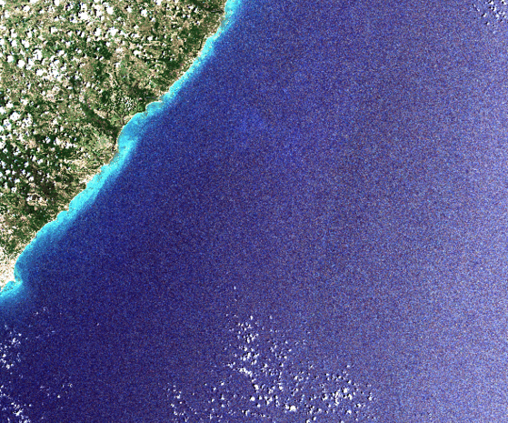

# Raster Crop with Shapefile

The goal of this repository is to demonstrate the use of a single script to perform the cropping of .tif images, using Sentinel-2 data and shapefiles as examples. In essence, with a single bash command, you can process a batch of images. Additionally, the developed code ensures the Coordinate Reference System (CRS) is checked and aligned.



### Additional Instructions

To use this repository, follow these steps:

1. **Clone the Repository**:
    
    - First, clone the repository to your local machine using the following command:
        
     ```bash
     git clone https://github.com/r-zimmerle/raster-crop-with-shapefile.git
     ```
        
2. **Organize Your Files**:
    
    - Place your shapefiles in the `polygons` directory. Ensure all related files (.cpg, .dbf, .prj, .qmd, .shp, .shx) are included.
    - Place your Sentinel-2 .tif images in the `sentinel2-silver` directory.
    
3. **Install the Required Python Packages**:
    
    Ensure you have the following libraries installed:
    
    - `gdal`
    - `fiona`
    - `shapely`
    - `rasterio`
    - `geopandas`
    
    You can install these libraries using Conda or pip.
    
    #### Option 1: Using Conda
    
    - To install these libraries, create and activate your Conda environment, then run:
        
        `conda create --name gdal_env conda activate gdal_env conda install -c conda-forge gdal fiona shapely rasterio geopandas`
        
    #### Option 2: Using pip
    
    - To install these libraries, run:
        
        `pip install gdal fiona shapely rasterio geopandas`
        
4. **Run the Script**:
    
    - Navigate to the root directory of the cloned repository.
    - Execute the cropping script:
        
        `python gdal-cut-by-mask.py`
        

By following these steps, you ensure that all files are correctly placed in their respective directories, and the required libraries are installed in your environment. This setup automates the process of cropping raster images, making it more efficient and accurate. The repository structure is designed to facilitate this workflow, enabling you to easily manage and execute your geospatial analyses with minimal manual intervention.